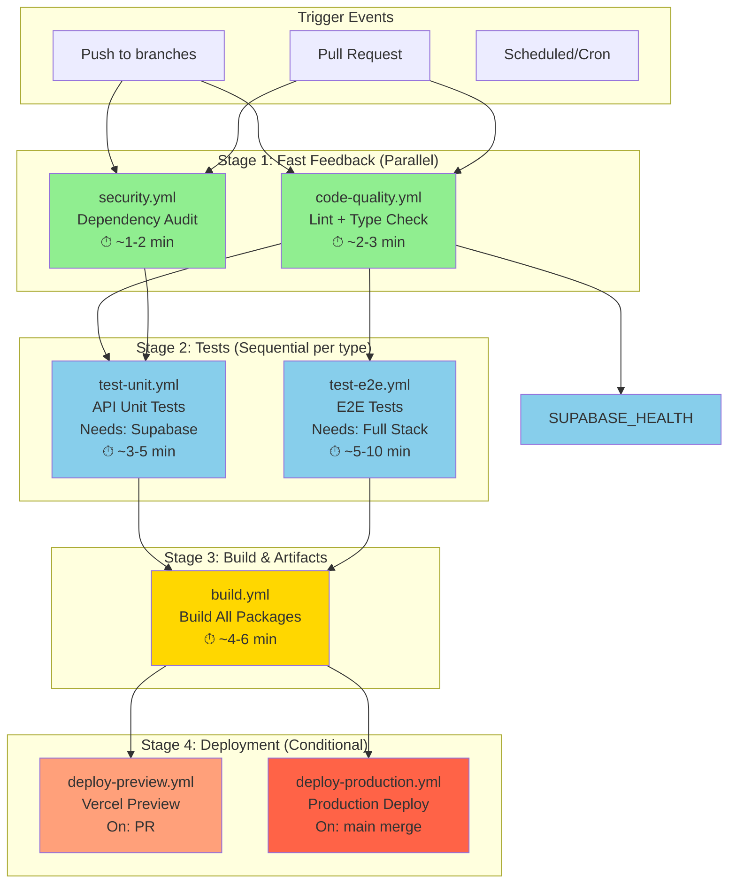

# CI/CD Workflows Architecture

## 🎯 Design Philosophy

**Separation of Concerns**: Each workflow handles a single responsibility
**Fail Fast**: Quick checks (linting, formatting) run first
**Parallelization**: Independent jobs run concurrently
**Reusability**: Common setup logic is shared via reusable workflows
**Cost Optimization**: Cache aggressively, skip redundant work
**Developer Experience**: Fast feedback, clear error messages

---

## 📊 Workflow Dependency Graph



---

## 📁 Proposed Workflow Files

### 1. **Reusable Workflows** (`.github/workflows/reusable/`)

#### `setup-node-pnpm.yml` (Reusable)
**Purpose**: Shared setup for Node, pnpm, caching, and dependency installation
**Used by**: All workflows
**Inputs**:
- `node-version` (default: 20)
- `install-deps` (default: true)
- `cache-key-suffix` (optional)

**Outputs**:
- `cache-hit`: Whether cache was restored
- `pnpm-version`: Installed pnpm version

**Key Steps**:
```yaml
- Setup Node (matrix or input version)
- Enable corepack + pnpm
- Restore cache (pnpm-store, node_modules, .turbo)
- Install dependencies (frozen-lockfile)
- Save cache
```

---

### 2. **Primary Workflows** (`.github/workflows/`)

#### `code-quality.yml` ⚡ **Fast Fail**
**Trigger**: `push`, `pull_request` (all branches)
**Dependencies**: None (runs immediately)
**Matrix**: Node 18, 20
**Timeout**: 10 minutes

**Jobs**:
1. **lint**
   - Prettier check (formatting commented for now)
   - ESLint (code quality)
   - Turbo lint (workspace-wide)
   
2. **typecheck**
   - Turbo type-check (TypeScript)
   
3. **lockfile-check**
   - Verify `pnpm-lock.yaml` is in sync
   
4. **unused-deps** (non-blocking)
   - Run depcheck for unused dependencies

**Why separate?**: 
- Fastest feedback (no DB, no tests)
- Fails before expensive operations
- Developers see linting errors immediately

---

#### `security.yml` 🔒 **Security Checks**
**Trigger**: `push`, `pull_request`, `schedule` (daily at 00:00 UTC)
**Dependencies**: None (runs in parallel with code-quality)
**Timeout**: 8 minutes

**Jobs**:
1. **audit-dependencies**
   - `pnpm audit --audit-level=moderate`
   - Report vulnerabilities
   
2. **license-check** (optional)
   - Check for incompatible licenses
   
3. **secrets-scan** (optional)
   - Use `truffleHog` or `gitleaks` to detect leaked secrets

**Why separate?**: 
- Security is a gate, not a test
- Can run on schedule (nightly scans)
- Non-blocking warnings vs blocking failures

---

#### `test-unit.yml` 🧪 **API Unit Tests**
**Trigger**: `workflow_run` (after code-quality succeeds), `workflow_dispatch` (manual)
**Dependencies**: Requires `code-quality.yml` to pass
**Matrix**: Node 18, 20 (max-parallel: 1 due to Supabase port)
**Timeout**: 15 minutes

**Jobs**:
1. **setup-supabase**
   - Install Supabase CLI
   - Clean existing state
   - Start local Supabase (port 54322)
   
2. **run-tests**
   - Push Prisma schema: `pnpm --filter ./packages/db run db:push:local`
   - Seed test DB: `pnpm --filter ./packages/db run db:seed:local`
   - Run tests: `pnpm --filter ./packages/api run test:coverage`
   - Upload coverage artifacts
   
3. **teardown-supabase**
   - Stop Supabase
   - Clean Docker volumes

**Why separate?**: 
- Heavy: needs PostgreSQL container
- Sequential execution (Supabase port conflict)
- Can be skipped for docs-only PRs
- Clear isolation of test infrastructure

---

#### `test-e2e.yml` 🌐 **End-to-End Tests** (Future)
**Trigger**: `workflow_run` (after test-unit succeeds), `workflow_dispatch`
**Dependencies**: Requires `test-unit.yml` to pass
**Timeout**: 20 minutes

**Jobs**:
1. **setup-stack**
   - Start Supabase
   - Start Next.js dev server
   - Wait for health checks
   
2. **run-e2e**
   - Playwright/Cypress tests
   - Visual regression tests
   - Upload screenshots/videos
   
3. **teardown-stack**
   - Stop all services

**Why separate?**: 
- Very expensive (full stack)
- Only needed for feature branches
- Can be optional for draft PRs

---

#### `build.yml` 🔨 **Build Verification**
**Trigger**: `workflow_run` (after tests pass), `workflow_dispatch`
**Dependencies**: Requires `test-unit.yml` to pass
**Matrix**: Node 18, 20
**Timeout**: 15 minutes

**Jobs**:
1. **build-packages**
   - `turbo build` (all packages + apps)
   - Analyze bundle sizes
   - Generate build reports
   - Upload build artifacts (`.next`, `dist/`)

**Why separate?**: 
- Build can be skipped if only tests changed
- Artifacts used by deployment workflows
- Bundle size tracking over time

---

#### `deploy-preview.yml` 🚀 **Preview Deployment (Future)**
**Trigger**: `workflow_run` (after build succeeds on PR), `pull_request` (labeled: `deploy-preview`)
**Dependencies**: Requires `build.yml` to pass
**Environment**: `preview`
**Timeout**: 10 minutes

**Jobs**:
1. **deploy-vercel-preview**
   - Download build artifacts
   - Deploy to Vercel preview
   - Comment PR with preview URL
   - Update deployment status

**Why separate?**: 
- Only runs on PRs
- Uses GitHub Environments (approval gates)
- Can be triggered manually with label

---

#### `deploy-production.yml` 🏭 **Production Deployment (Future)**
**Trigger**: `workflow_run` (after build succeeds on `main`), `workflow_dispatch`
**Dependencies**: Requires `build.yml` to pass on `main` branch
**Environment**: `production` (requires approval)
**Timeout**: 15 minutes

**Jobs**:
1. **pre-deploy-checks**
   - Verify all checks passed
   - Check if version bumped
   - Notify team (Slack/Discord)
   
2. **deploy-production**
   - Download build artifacts
   - Deploy to Vercel production
   - Tag release
   - Create GitHub release notes
   
3. **post-deploy**
   - Smoke tests
   - Notify on success/failure

**Why separate?**: 
- Production is a special environment
- Requires manual approval
- Rollback strategy isolated

---

## 🔄 Workflow Execution Flow

### On Pull Request:
```
1. code-quality.yml   ⚡ (2-3 min) ─┐
   security.yml       🔒 (1-2 min) ─┤
                                     ├─> PASS ─> 2. test-unit.yml 🧪 (5 min)
                                     │                    │
                                     └─> FAIL ─> ❌ STOP  │
                                                          │
                                                          v
                                                    3. build.yml 🔨 (5 min)
                                                          │
                                                          v
                                                    4. deploy-preview.yml 🚀 (3 min)
                                                          │
                                                          v
                                                    ✅ Preview URL in PR comment
```

### On Push to `main`:
```
1. code-quality.yml   ⚡ (2-3 min) ─┐
   security.yml       🔒 (1-2 min) ─┤
                                     ├─> PASS ─> 2. test-unit.yml 🧪 (5 min)
                                     │                    │
                                     └─> FAIL ─> ❌ STOP  │
                                                          │
                                                          v
                                                    3. build.yml 🔨 (5 min)
                                                          │
                                                          v
                                                    4. deploy-production.yml 🏭
                                                       (requires approval)
                                                          │
                                                          v
                                                    ✅ Production deployed
```

---

## 🎨 Best Practices Applied

### 1. **Caching Strategy**
- **Cache Key**: `${{ runner.os }}-node${{ matrix.node-version }}-pnpm-${{ hashFiles('**/pnpm-lock.yaml') }}`
- **Cached Paths**:
  - `~/.pnpm-store` (pnpm global store)
  - `**/node_modules` (workspace node_modules)
  - `.turbo` (Turbo cache for builds)
- **Restoration**: Prefix-based restore-keys for partial matches

### 2. **Concurrency Control**
```yaml
concurrency:
  group: ${{ github.workflow }}-${{ github.ref }}
  cancel-in-progress: true  # Cancel old runs on new push
```

### 3. **Matrix Strategy**
- Node 18, 20 for compatibility
- `max-parallel: 1` for Supabase tests (port conflicts)
- `fail-fast: false` to see all matrix results

### 4. **Timeouts**
- Prevent hanging jobs
- Fast feedback on infinite loops
- Cost control

### 5. **Conditional Execution**
```yaml
# Skip on docs-only changes
if: |
  !contains(github.event.head_commit.message, '[skip ci]') &&
  !contains(github.event.head_commit.message, '[docs only]')
```

### 6. **Reusable Workflows**
- Share setup logic via `workflow_call`
- Reduce duplication
- Consistent environment setup

### 7. **Artifact Management**
- Upload test coverage for reporting
- Share build artifacts between workflows
- Retention: 7 days (cost optimization)

### 8. **Environment Secrets**
- `preview` environment (auto-deploy)
- `production` environment (manual approval)
- Scoped secrets per environment

---

## 📂 Final File Structure

```
.github/
├── workflows/
│   ├── code-quality.yml          # Lint, typecheck, formatting
│   ├── security.yml               # Audit, secrets scan
│   ├── test-unit.yml              # API unit tests + Supabase
│   ├── test-e2e.yml               # E2E tests (future)
│   ├── build.yml                  # Build all packages
│   ├── deploy-preview.yml         # Preview deployments
│   ├── deploy-production.yml      # Production deployments
│   └── reusable/
│       └── setup-node-pnpm.yml    # Shared Node/pnpm setup
└── actions/                       # Custom composite actions (future)
    ├── setup-supabase/
    └── analyze-bundle/
```

---

## 🚦 Workflow Triggers Summary

| Workflow              | push | pull_request | workflow_run | schedule | workflow_dispatch |
|-----------------------|------|--------------|--------------|----------|-------------------|
| code-quality.yml      | ✅    | ✅            | ❌            | ❌        | ✅                 |
| security.yml          | ✅    | ✅            | ❌            | ✅ (daily) | ✅                 |
| test-unit.yml         | ❌    | ❌            | ✅            | ❌        | ✅                 |
| test-e2e.yml          | ❌    | ❌            | ✅            | ❌        | ✅                 |
| build.yml             | ❌    | ❌            | ✅            | ❌        | ✅                 |
| deploy-preview.yml    | ❌    | ✅ (on label) | ✅            | ❌        | ✅                 |
| deploy-production.yml | ❌    | ❌            | ✅ (main only)| ❌        | ✅                 |


1. **E2E tests now or later** (Can start with Phase 1)
2. **Vercel deployment setup** (Need Vercel token in secrets)
3. **Production approval gate** (Manual approval or auto-deploy?)
4. **Slack/Discord notifications** (On failures/deployments)
5. **Matrix strategy for tests** (Node 18, 20 or just 20?)

---
