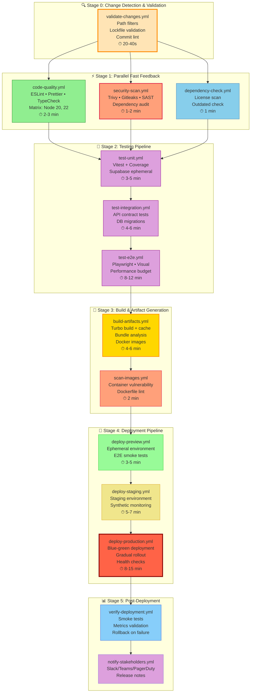

# CI/CD Workflows Architecture

> **Production-Grade DevOps Pipeline for Monorepo**  
> Built with GitHub Actions | Designed for Scale & Security | Optimized for Developer Experience

---

## 🎯 Core Design Principles

### 1. **Shift-Left Security**
- Security gates at every stage, not just deployment
- SAST, SCA, and secret scanning before code merges
- Automated compliance checks (licenses, vulnerabilities)

### 2. **Progressive Verification**
```
Fast Feedback → Comprehensive Testing → Artifact Generation → Deployment
   (30s-2m)         (3-8m)                (2-5m)            (3-10m)
```

### 3. **Intelligent Caching & Optimization**
- Multi-layer caching: dependencies, builds, test results
- Turborepo remote caching for distributed builds
- Change detection to skip unchanged packages

### 4. **Observability & Metrics**
- Build time tracking and alerting
- Test coverage trending
- Deployment health checks with rollback capabilities
- DORA metrics collection (lead time, deployment frequency, MTTR)

### 5. **Idempotency & Reproducibility**
- Frozen lockfiles enforced
- Docker-based test environments
- Versioned toolchains (Node, pnpm, Supabase CLI)

### 6. **Environment Parity**
- Dev/Staging/Production environment matching
- Infrastructure as Code principles
- Feature flag integration for safe rollouts

### 7. **Cost Efficiency**
- Workflow concurrency limits
- Early termination on failures
- Conditional job execution based on changed files
- Artifact retention policies

---

## 🏗️ Pipeline Architecture



---

## � Workflow Inventory

### **Core Workflows** (`/.github/workflows/`)

| Workflow | Trigger | Stage | SLA | Critical Path |
|----------|---------|-------|-----|---------------|
| `validate-changes.yml` | push, PR | 0 | 40s | ✅ |
| `code-quality.yml` | push, PR | 1 | 3m | ✅ |
| `security-scan.yml` | push, PR, schedule | 1 | 2m | ✅ |
| `dependency-check.yml` | push, PR, schedule | 1 | 1m | ⚠️ |
| `test-unit.yml` | workflow_run | 2 | 5m | ✅ |
| `test-integration.yml` | workflow_run | 2 | 6m | ✅ |
| `test-e2e.yml` | workflow_run | 2 | 12m | ⚠️ |
| `build-artifacts.yml` | workflow_run | 3 | 6m | ✅ |
| `scan-images.yml` | workflow_run | 3 | 2m | ✅ |
| `deploy-preview.yml` | PR (labeled) | 4 | 5m | - |
| `deploy-staging.yml` | push (develop) | 4 | 7m | ✅ |
| `deploy-production.yml` | push (main) | 4 | 15m | ✅ |
| `verify-deployment.yml` | workflow_run | 5 | 3m | ✅ |
| `rollback-deployment.yml` | workflow_dispatch | 5 | 5m | - |

✅ = Blocks deployment | ⚠️ = Non-blocking warning | - = Optional

---

## 🔧 Reusable Workflows & Actions

### 1. **Composite Actions** (`.github/actions/`)

#### `setup-environment/action.yml`
**Purpose**: Standard environment setup with caching
**Inputs**:
- `node-version` (default: 20)
- `enable-turbo-cache` (default: true)
- `cache-key-prefix` (optional)
- `install-dependencies` (default: true)

**Outputs**:
- `cache-hit`: boolean
- `node-version`: string
- `pnpm-version`: string
- `turbo-version`: string

**Implementation**:
```yaml
steps:
  - name: Setup Node.js
    uses: actions/setup-node@v4
    with:
      node-version: ${{ inputs.node-version }}
      
  - name: Enable Corepack
    run: corepack enable
    
  - name: Get pnpm store directory
    id: pnpm-cache
    run: echo "STORE_PATH=$(pnpm store path)" >> $GITHUB_OUTPUT
    
  - name: Setup pnpm cache
    uses: actions/cache@v4
    with:
      path: |
        ${{ steps.pnpm-cache.outputs.STORE_PATH }}
        **/node_modules
        .turbo
        ~/.cache/Cypress
      key: ${{ runner.os }}-pnpm-${{ hashFiles('**/pnpm-lock.yaml') }}
      restore-keys: |
        ${{ runner.os }}-pnpm-
        
  - name: Install dependencies
    if: inputs.install-dependencies == 'true'
    run: pnpm install --frozen-lockfile
    
  - name: Configure Turbo cache
    if: inputs.enable-turbo-cache == 'true'
    run: |
      pnpm turbo link --api=${{ secrets.TURBOREPO_API }}
      pnpm turbo login --token=${{ secrets.TURBOREPO_TOKEN }}
```

#### `setup-supabase/action.yml`
**Purpose**: Ephemeral Supabase instance for testing
**Inputs**:
- `supabase-version` (default: latest)
- `database-port` (default: 54322)
- `studio-port` (default: 54323)

**Features**:
- Docker Compose based setup
- Automated schema migration
- Test data seeding
- Health check validation
- Automatic cleanup on failure

#### `analyze-bundle/action.yml`
**Purpose**: Bundle size analysis and reporting
**Outputs**:
- `bundle-size`: Total bundle size in KB
- `size-change`: Percentage change from base branch
- `report-url`: Link to detailed report

#### `notify-status/action.yml`
**Purpose**: Multi-channel notification dispatcher
**Inputs**:
- `status`: success | failure | warning
- `channels`: slack,teams,discord,pagerduty
- `workflow-name`: Current workflow name
- `deployment-url`: Optional URL

---

### 2. **Reusable Workflows** (`.github/workflows/.reusable/`)

#### `docker-build-push.yml`
**Purpose**: Standard Docker build and push workflow
**Inputs**:
- `dockerfile-path`
- `image-name`
- `build-args` (JSON)
- `platforms` (default: linux/amd64,linux/arm64)
- `push-to-registry` (boolean)

**Features**:
- Multi-platform builds
- BuildKit cache
- SBOM generation
- Image signing with cosign
- Trivy vulnerability scanning

#### `run-tests-with-coverage.yml`
**Purpose**: Test execution with coverage reporting
**Inputs**:
- `test-command`
- `coverage-threshold` (default: 80)
- `upload-to-codecov` (boolean)

---

## 📝 Detailed Workflow Specifications

### Stage 0: Change Detection & Validation

#### `validate-changes.yml` 🔍
**Triggers**: `push`, `pull_request`
**Timeout**: 5 minutes
**Purpose**: Fast preliminary checks before running expensive operations

**Jobs**:

1. **path-filter**
   ```yaml
   - uses: dorny/paths-filter@v3
     id: filter
     with:
       filters: |
         backend:
           - 'packages/api/**'
           - 'packages/db/**'
         frontend:
           - 'apps/nextjs/**'
           - 'apps/farmers-app/**'
         infra:
           - '.github/**'
           - 'supabase/**'
         docs:
           - '**.md'
           - 'docs/**'
   ```
   **Outputs**: Boolean flags for each area changed
   **Use**: Conditional workflow execution

2. **validate-lockfile**
   - Check `pnpm-lock.yaml` integrity
   - Verify no dependencies without pinned versions
   - Ensure lock file is committed

3. **commit-lint** (PR only)
   - Conventional commits enforcement
   - Check commit signatures (if required)
   - Validate branch naming convention

4. **duplicate-check**
   - Check for accidental duplicate dependencies
   - Warn about multiple versions of same package

**Success Criteria**: All validation checks pass
**On Failure**: Block entire pipeline

---

### Stage 1: Parallel Fast Feedback

#### `code-quality.yml` ⚡
**Triggers**: `workflow_run` (after validate-changes), `workflow_dispatch`
**Timeout**: 10 minutes
**Matrix**: Node 20, 22 (fail-fast: false)

**Jobs**:

1. **lint-code**
   ```bash
   # Run ESLint with auto-fix disabled
   pnpm turbo lint --no-cache --continue
   
   # Check for console.log statements (CI mode)
   pnpm turbo lint:strict
   ```

2. **format-check**
   ```bash
   # Prettier check (no write)
   pnpm prettier --check "**/*.{ts,tsx,js,jsx,json,md}"
   
   # EditorConfig validation
   pnpm eclint check
   ```

3. **type-check**
   ```bash
   # TypeScript compilation check (no emit)
   pnpm turbo type-check --concurrency=3
   
   # Generate type coverage report
   pnpm type-coverage --detail
   ```

4. **circular-deps-check**
   ```bash
   # Detect circular dependencies
   pnpm madge --circular --extensions ts,tsx ./packages
   ```

5. **code-metrics** (non-blocking)
   - Calculate code complexity (cyclomatic complexity)
   - Generate maintainability index
   - Upload to SonarCloud/CodeClimate

**Artifacts**:
- Lint reports (JSON, SARIF)
- Type coverage reports
- Code quality metrics

**Caching Strategy**:
- Cache ESLint cache (`.eslintcache`)
- Cache TypeScript build info
- Restore on same lockfile hash

---

#### `security-scan.yml` 🔒
**Triggers**: `workflow_run`, `schedule` (daily 02:00 UTC), `workflow_dispatch`
**Timeout**: 15 minutes
**Concurrency**: `security-${{ github.ref }}` (cancel-in-progress: false)

**Jobs**:

1. **secret-scanning**
   ```bash
   # Scan for exposed secrets
   gitleaks detect --source=. --verbose --redact
   
   # Check for hardcoded tokens/keys
   trufflehog filesystem . --json --only-verified
   ```

2. **dependency-audit**
   ```bash
   # High/Critical vulnerabilities fail the build
   pnpm audit --audit-level=high --production
   
   # Generate SBOM (Software Bill of Materials)
   pnpm sbom --format=cyclonedx --output=sbom.json
   
   # Check against known vulnerabilities database
   grype sbom:./sbom.json --fail-on=high
   ```

3. **sast-analysis** (Static Application Security Testing)
   ```bash
   # CodeQL analysis for TypeScript/JavaScript
   codeql database create db --language=javascript
   codeql database analyze db --format=sarif-latest --output=results.sarif
   
   # Semgrep security rules
   semgrep --config=auto --sarif --output=semgrep.sarif
   ```

4. **license-compliance**
   ```bash
   # Check for incompatible licenses
   pnpm license-checker --production --failOn "GPL;AGPL"
   
   # Generate license report
   pnpm generate-license-file --input package.json --output LICENSES.txt
   ```

5. **supply-chain-security**
   - Verify package signatures
   - Check for typosquatting
   - Validate package provenance (npm provenance)

**Artifacts**:
- SARIF reports (uploaded to GitHub Security)
- SBOM files
- Audit logs
- License reports

**Notifications**:
- Slack alert on new vulnerabilities
- GitHub Security Advisory creation
- PagerDuty alert for critical CVEs

---

#### `dependency-check.yml` 📦
**Triggers**: `workflow_run`, `schedule` (weekly), `workflow_dispatch`
**Timeout**: 8 minutes

**Jobs**:

1. **outdated-check**
   ```bash
   # Check for outdated dependencies
   pnpm outdated --format=json > outdated.json
   
   # Create PR comment with update suggestions
   gh pr comment $PR_NUMBER --body-file outdated-report.md
   ```

2. **unused-deps**
   ```bash
   # Find unused dependencies
   pnpm depcheck --json > depcheck.json
   
   # Find duplicates across workspace
   pnpm dedupe --check
   ```

3. **breaking-changes**
   - Check for major version updates
   - Analyze changelogs for breaking changes
   - Suggest migration paths

**Artifacts**:
- Dependency update report
- Breaking changes summary

---

### Stage 2: Testing Pipeline

#### `test-unit.yml` 🧪
**Triggers**: `workflow_run` (after Stage 1 success), `workflow_dispatch`
**Timeout**: 20 minutes
**Matrix**: 
  - Node: [20, 22]
  - OS: [ubuntu-latest] (expand to macos/windows if needed)

**Jobs**:

1. **setup-test-env**
   ```bash
   # Start Supabase with Docker Compose
   supabase start --workdir ./supabase
   
   # Wait for healthy state
   curl --retry 10 --retry-delay 3 http://localhost:54321/health
   
   # Apply migrations
   pnpm --filter @kilimo/db prisma migrate deploy --schema=./prisma/schema.prisma
   
   # Seed test data
   pnpm --filter @kilimo/db db:seed:test
   ```

2. **run-unit-tests**
   ```bash
   # Run Vitest with coverage
   pnpm --filter @kilimo/api test:coverage --reporter=verbose --reporter=json
   
   # Generate coverage badges
   npx coverage-badges-cli --output=./coverage/badges
   ```

3. **upload-coverage**
   - Upload to Codecov
   - Upload to Coveralls
   - Store as artifact for trending

4. **teardown**
   ```bash
   # Stop Supabase
   supabase stop --no-backup
   
   # Clean Docker volumes
   docker volume prune -f
   ```

**Success Criteria**:
- All tests pass
- Coverage ≥ 80% (configurable)
- No test timeouts

**Artifacts**:
- Coverage reports (lcov, HTML)
- Test results (JUnit XML)
- Performance benchmarks

**Optimizations**:
- Parallel test execution (vitest --poolOptions.threads=4)
- Snapshot diffing for only changed tests
- Test result caching

---

#### `test-integration.yml` 🔗
**Triggers**: `workflow_run` (after test-unit), `workflow_dispatch`
**Timeout**: 25 minutes

**Jobs**:

1. **api-contract-tests**
   - OpenAPI/Swagger validation
   - API contract testing (Pact)
   - GraphQL schema validation

2. **database-tests**
   ```bash
   # Test migrations (up and down)
   pnpm db:migrate:test
   
   # Test rollback scenarios
   pnpm db:rollback:test
   
   # Verify RLS policies
   pnpm db:test:rls
   ```

3. **integration-suite**
   - Test inter-service communication
   - Test external API integrations (mocked)
   - Test authentication flows

**Artifacts**:
- Contract test results
- Migration test logs
- Integration test reports

---

#### `test-e2e.yml` 🌐
**Triggers**: `workflow_run` (after test-integration), `workflow_dispatch`, `schedule` (nightly)
**Timeout**: 30 minutes
**Concurrency**: `e2e-${{ github.ref }}` (max 1 concurrent)

**Jobs**:

1. **setup-full-stack**
   ```bash
   # Start all services
   docker-compose -f docker-compose.test.yml up -d
   
   # Start Next.js app
   pnpm --filter @kilimo/nextjs dev &
   
   # Wait for services
   ./scripts/wait-for-services.sh
   ```

2. **run-e2e-tests**
   ```bash
   # Playwright tests with retries
   pnpm --filter @kilimo/nextjs test:e2e --retries=2
   
   # Visual regression tests
   pnpm test:visual --update-snapshots=false
   ```

3. **performance-tests**
   ```bash
   # Lighthouse CI
   lhci autorun --config=.lighthouserc.json
   
   # Check performance budgets
   bundlesize check
   ```

4. **accessibility-tests**
   ```bash
   # Axe accessibility tests
   pnpm test:a11y
   
   # WCAG 2.1 AA compliance check
   pa11y-ci --config .pa11yrc
   ```

**Success Criteria**:
- All E2E tests pass (2 retries allowed)
- Performance score ≥ 90
- No critical accessibility issues
- Visual regression diffs ≤ 1%

**Artifacts**:
- Playwright reports (HTML, video, trace)
- Lighthouse reports
- Visual diff screenshots
- Accessibility audit results

**Optimizations**:
- Parallel test sharding (4 workers)
- Browser caching between tests
- Conditional execution (only on feature branches)

---

### Stage 3: Build & Artifact Generation

#### `build-artifacts.yml` 🔨
**Triggers**: `workflow_run` (after all tests pass), `workflow_dispatch`
**Timeout**: 20 minutes
**Matrix**: 
  - Platform: [linux/amd64, linux/arm64]

**Jobs**:

1. **build-packages**
   ```bash
   # Clean build
   pnpm turbo clean
   
   # Build all packages with Turbo cache
   pnpm turbo build --cache-dir=.turbo-cache
   
   # Generate build manifest
   pnpm turbo build --dry-run=json > build-manifest.json
   ```

2. **bundle-analysis**
   ```bash
   # Analyze Next.js bundle
   ANALYZE=true pnpm --filter @kilimo/nextjs build
   
   # Compare with base branch
   npx bundle-analyzer compare base..head
   
   # Check bundle size limits
   bundlesize check --config=.bundlesizerc
   ```

3. **build-docker-images**
   ```bash
   # Multi-platform build
   docker buildx build \
     --platform linux/amd64,linux/arm64 \
     --tag kilimo/nextjs:${{ github.sha }} \
     --cache-from type=gha \
     --cache-to type=gha,mode=max \
     --push \
     -f apps/nextjs/Dockerfile .
   ```

4. **generate-artifacts**
   - Export static assets
   - Generate sourcemaps (with sentry integration)
   - Create deployment archives

**Artifacts**:
- Build outputs (dist/, .next/)
- Docker images (pushed to registry)
- Bundle analysis reports
- Sourcemaps (uploaded to Sentry)

**Optimizations**:
- Turborepo remote caching (Vercel/GitHub artifacts)
- Docker layer caching
- Incremental builds (only changed packages)

---

#### `scan-images.yml` 🔍
**Triggers**: `workflow_run` (after build-artifacts), `workflow_dispatch`
**Timeout**: 10 minutes

**Jobs**:

1. **vulnerability-scan**
   ```bash
   # Trivy scan
   trivy image \
     --severity HIGH,CRITICAL \
     --exit-code 1 \
     --format sarif \
     --output trivy-results.sarif \
     kilimo/nextjs:${{ github.sha }}
   
   # Grype scan (alternative/complementary)
   grype kilimo/nextjs:${{ github.sha }} --fail-on high
   ```

2. **dockerfile-lint**
   ```bash
   # Hadolint
   hadolint apps/nextjs/Dockerfile
   
   # Dive (layer analysis)
   dive kilimo/nextjs:${{ github.sha }} --ci
   ```

3. **image-signing**
   ```bash
   # Sign with Cosign
   cosign sign --key cosign.key kilimo/nextjs:${{ github.sha }}
   
   # Generate SBOM
   syft kilimo/nextjs:${{ github.sha }} -o spdx-json > sbom.spdx.json
   ```

**Success Criteria**:
- No HIGH/CRITICAL vulnerabilities
- Image size within budget (< 500MB)
- All security best practices followed

**Artifacts**:
- Vulnerability scan reports
- SBOMs
- Image signatures

---

### Stage 4: Deployment Pipeline

#### `deploy-preview.yml` 🚀
**Triggers**: `pull_request` (labeled: deploy-preview), `workflow_run`
**Timeout**: 15 minutes
**Environment**: `preview` (no approval required)

**Jobs**:

1. **create-preview-env**
   ```bash
   # Create ephemeral environment
   vercel deploy --prebuilt --token=${{ secrets.VERCEL_TOKEN }}
   
   # Get preview URL
   PREVIEW_URL=$(vercel inspect --token=${{ secrets.VERCEL_TOKEN}} --json | jq -r '.url')
   ```

2. **deploy-app**
   - Deploy Next.js app to Vercel
   - Deploy Supabase migrations to staging project
   - Configure environment variables

3. **smoke-tests**
   ```bash
   # Basic health checks
   curl --fail $PREVIEW_URL/api/health
   
   # Critical path tests
   playwright test --grep=@smoke --base-url=$PREVIEW_URL
   ```

4. **notify-pr**
   ```bash
   # Comment on PR with preview URL
   gh pr comment $PR_NUMBER --body "🚀 Preview deployed: $PREVIEW_URL"
   
   # Add deployment status
   gh pr status $PR_NUMBER --deployment=preview --url=$PREVIEW_URL
   ```

**Success Criteria**:
- Deployment successful
- Smoke tests pass
- Preview URL accessible

**Artifacts**:
- Deployment logs
- Smoke test results

**Cleanup**: Auto-delete preview after PR close

---

#### `deploy-staging.yml` 🏗️
**Triggers**: `push` (branch: develop), `workflow_dispatch`
**Timeout**: 20 minutes
**Environment**: `staging` (approval: 1 reviewer)

**Jobs**:

1. **pre-deploy-checks**
   - Verify all Stage 3 artifacts exist
   - Check database migration compatibility
   - Validate environment configuration

2. **database-migration**
   ```bash
   # Backup staging DB
   supabase db dump --project-ref $STAGING_PROJECT > backup.sql
   
   # Run migrations
   pnpm --filter @kilimo/db prisma migrate deploy
   
   # Verify migration success
   pnpm db:verify-migration
   ```

3. **deploy-application**
   ```bash
   # Deploy with blue-green strategy
   vercel deploy --prod --token=${{ secrets.VERCEL_TOKEN }}
   
   # Gradual traffic shift (10% → 50% → 100%)
   ./scripts/gradual-rollout.sh staging
   ```

4. **post-deploy-verification**
   ```bash
   # Health checks
   ./scripts/health-check.sh staging
   
   # Synthetic monitoring
   ./scripts/run-synthetic-tests.sh staging
   
   # Check error rates
   sentry-cli releases deploys $VERSION finalize
   ```

5. **rollback-on-failure**
   ```bash
   # Auto-rollback if health checks fail
   if [ $? -ne 0 ]; then
     vercel rollback --token=${{ secrets.VERCEL_TOKEN }}
     supabase db restore --project-ref $STAGING_PROJECT backup.sql
   fi
   ```

**Success Criteria**:
- Zero-downtime deployment
- Health checks pass
- Error rate < baseline + 5%
- Response time < baseline + 10%

**Notifications**:
- Slack: #deployments channel
- Email: Engineering team
- Dashboard: Deployment status update

---

#### `deploy-production.yml` 🏭
**Triggers**: `push` (branch: main), `workflow_dispatch`
**Timeout**: 30 minutes
**Environment**: `production` (approval: 2 reviewers + change advisory board)

**Jobs**:

1. **pre-flight-checks**
   ```bash
   # Verify all tests passed
   gh run list --workflow=test-e2e.yml --status=success --limit=1
   
   # Check for open incidents
   curl -X GET "https://api.pagerduty.com/incidents" -H "Authorization: Token $PD_TOKEN"
   
   # Verify change window (avoid peak hours)
   ./scripts/check-deployment-window.sh
   ```

2. **create-release**
   ```bash
   # Generate changelog
   conventional-changelog -p angular -i CHANGELOG.md -s
   
   # Create GitHub release
   gh release create v${{ github.run_number }} --generate-notes
   
   # Tag Docker images
   docker tag kilimo/nextjs:${{ github.sha }} kilimo/nextjs:latest
   docker push kilimo/nextjs:latest
   ```

3. **database-migration**
   ```bash
   # Production DB backup (point-in-time)
   supabase db dump --project-ref $PROD_PROJECT > prod-backup-$(date +%Y%m%d_%H%M%S).sql
   
   # Upload backup to S3
   aws s3 cp prod-backup-*.sql s3://kilimo-db-backups/
   
   # Run migrations with transaction
   pnpm db:migrate:prod --transaction
   ```

4. **canary-deployment**
   ```bash
   # Deploy to canary servers (5% traffic)
   ./scripts/deploy-canary.sh
   
   # Monitor for 10 minutes
   sleep 600
   
   # Check canary metrics
   if ./scripts/check-canary-health.sh; then
     echo "Canary healthy, proceeding with full deployment"
   else
     echo "Canary failed, rolling back"
     exit 1
   fi
   ```

5. **full-deployment**
   ```bash
   # Blue-green deployment
   vercel deploy --prod --alias production
   
   # Gradual traffic shift (10% → 25% → 50% → 100%)
   # 5 min intervals with health checks between each step
   ./scripts/gradual-rollout.sh production
   ```

6. **post-deploy-verification**
   ```bash
   # Comprehensive health checks
   ./scripts/health-check.sh production --comprehensive
   
   # Performance verification
   ./scripts/verify-performance-budgets.sh
   
   # Error rate monitoring (15 min window)
   ./scripts/monitor-error-rates.sh --duration=900
   ```

7. **finalize-deployment**
   ```bash
   # Update Sentry release
   sentry-cli releases finalize $VERSION
   
   # Update status page
   statuspage-cli update --status=operational
   
   # Create deployment record
   ./scripts/record-deployment.sh
   ```

**Rollback Strategy**:
```yaml
on-failure:
  - Automatic rollback if:
    - Health checks fail (3 consecutive)
    - Error rate > baseline + 20%
    - Response time > baseline + 50%
    - CPU/Memory > 85%
  
  - Manual rollback via:
    - workflow_dispatch trigger
    - Vercel dashboard
    - Terraform destroy + re-apply
```

**Success Criteria**:
- Zero-downtime deployment
- All health checks pass
- Error rate within SLA (< 0.1%)
- P95 latency < 500ms
- No customer-reported issues in first hour

**Notifications**:
- Slack: #deployments, #general
- Email: All engineering + leadership
- PagerDuty: On-call notification
- Status page: Deployment announcement
- Customer email: For major releases

**Artifacts**:
- Deployment manifest
- Performance reports
- Database backup references
- Rollback scripts

---

### Stage 5: Post-Deployment

#### `verify-deployment.yml` ✅
**Triggers**: `workflow_run` (after any deployment), `schedule` (hourly)
**Timeout**: 10 minutes

**Jobs**:

1. **health-checks**
   - API endpoint availability
   - Database connectivity
   - External service connectivity (Supabase, Stripe, etc.)

2. **functional-tests**
   - Critical user journeys
   - Authentication flows
   - Payment processing (test mode)

3. **performance-verification**
   - Load testing (k6)
   - Response time validation
   - Resource utilization check

4. **security-verification**
   - TLS/SSL certificate validation
   - Security headers check
   - CSP policy verification

**On Failure**: Trigger automatic rollback

---

#### `rollback-deployment.yml` ↩️
**Triggers**: `workflow_dispatch` (manual), `workflow_call` (from verify-deployment)
**Timeout**: 10 minutes

**Jobs**:

1. **initiate-rollback**
   - Identify previous stable version
   - Notify stakeholders

2. **rollback-application**
   ```bash
   # Vercel rollback
   vercel rollback --token=${{ secrets.VERCEL_TOKEN }}
   
   # Or specific version
   vercel promote $PREVIOUS_VERSION --token=${{ secrets.VERCEL_TOKEN }}
   ```

3. **rollback-database** (if needed)
   ```bash
   # Restore from backup
   supabase db restore --project-ref $PROD_PROJECT backup.sql
   ```

4. **verify-rollback**
   - Health checks
   - Smoke tests
   - Verify error rates normalized

**Notifications**:
- Incident report created
- All stakeholders notified
- Post-mortem scheduled

---

## 🔐 Security & Compliance

### Secret Management

**GitHub Secrets** (encrypted at rest):
```yaml
# Deployment
VERCEL_TOKEN
VERCEL_ORG_ID
VERCEL_PROJECT_ID

# Supabase
SUPABASE_ACCESS_TOKEN
SUPABASE_DB_PASSWORD
SUPABASE_PROJECT_REF_STAGING
SUPABASE_PROJECT_REF_PROD

# Monitoring & Observability
SENTRY_AUTH_TOKEN
SENTRY_ORG
DATADOG_API_KEY

# Notifications
SLACK_WEBHOOK_URL
PAGERDUTY_TOKEN

# Container Registry
DOCKER_USERNAME
DOCKER_PASSWORD

# Code Quality
SONARCLOUD_TOKEN
CODECOV_TOKEN

# Turborepo
TURBOREPO_API
TURBOREPO_TOKEN

# Signing
COSIGN_PRIVATE_KEY
COSIGN_PASSWORD
```

**Environment-Specific Secrets**:
- Stored in GitHub Environments (preview, staging, production)
- Require environment protection rules
- Audit log of all secret access

### Compliance Controls

1. **Branch Protection**
   - `main`: Require 2 approvals, require tests, no force push
   - `develop`: Require 1 approval, require tests
   - Status checks must pass: code-quality, security-scan, test-unit

2. **Required Reviews**
   - Code owners approval for sensitive paths
   - Security team review for dependency changes
   - DevOps review for infrastructure changes

3. **Audit Logging**
   - All workflow runs logged
   - Deployment history tracked
   - Secret access audited
   - Failed login attempts monitored

4. **Compliance Checks**
   - SOC 2 compliance validation
   - GDPR data handling checks
   - License compliance enforcement
   - Security posture validation

---

## 📊 Monitoring & Observability

### Workflow Metrics

**Key Performance Indicators**:
- **DORA Metrics**:
  - Deployment Frequency: Target daily
  - Lead Time for Changes: < 2 hours
  - Change Failure Rate: < 5%
  - Mean Time to Recovery: < 30 minutes

- **CI/CD Performance**:
  - Pipeline success rate: > 95%
  - Average pipeline duration: < 20 minutes
  - Cache hit rate: > 80%
  - Artifact size trend

**Monitoring Tools**:
```yaml
# GitHub Actions Insights
- Workflow run times
- Job success/failure rates
- Resource utilization
- Cache effectiveness

# Custom Dashboards (Datadog/Grafana)
- Pipeline duration over time
- Test coverage trends
- Bundle size evolution
- Deployment frequency
- Rollback rate

# Alerting Rules
- Pipeline failure (Slack + PagerDuty)
- Security vulnerability detected (immediate)
- Deployment failure (PagerDuty)
- Test coverage drop > 5%
- Build time increase > 20%
```

### Application Monitoring

**Real User Monitoring (RUM)**:
- Sentry for error tracking
- LogRocket for session replay
- Datadog RUM for performance

**Synthetic Monitoring**:
- Pingdom/UptimeRobot for uptime
- Custom health check scripts (every 5 min)
- API endpoint monitoring

**Performance Tracking**:
- Core Web Vitals (LCP, FID, CLS)
- Time to First Byte (TTFB)
- API response times
- Database query performance

---

## 🎯 Optimization Strategies

### 1. **Intelligent Job Skipping**

```yaml
# Path-based conditional execution
jobs:
  test-api:
    if: contains(needs.changes.outputs.changed, 'packages/api')
    
  test-frontend:
    if: contains(needs.changes.outputs.changed, 'apps/nextjs')
    
  # Skip CI for docs-only changes
  skip-ci:
    if: |
      contains(github.event.head_commit.message, '[skip ci]') ||
      (needs.changes.outputs.docs == 'true' && needs.changes.outputs.code == 'false')
```

### 2. **Advanced Caching**

**Multi-Layer Cache Strategy**:
```yaml
# Layer 1: GitHub Actions Cache
- uses: actions/cache@v4
  with:
    path: |
      ~/.pnpm-store
      **/node_modules
      .turbo
      .next/cache
    key: ${{ runner.os }}-${{ hashFiles('**/pnpm-lock.yaml') }}
    
# Layer 2: Turborepo Remote Cache
- run: turbo build --token=${{ secrets.TURBOREPO_TOKEN }}

# Layer 3: Docker Layer Cache
- uses: docker/build-push-action@v5
  with:
    cache-from: type=gha
    cache-to: type=gha,mode=max
    
# Layer 4: CDN Cache (Vercel Edge Cache)
- headers:
    Cache-Control: public, max-age=31536000, immutable
```

### 3. **Parallel Execution Matrix**

```yaml
strategy:
  matrix:
    node-version: [20, 22]
    os: [ubuntu-latest, macos-latest]
    shard: [1, 2, 3, 4]  # Test sharding
  max-parallel: 8
  fail-fast: false
```

### 4. **Resource Optimization**

```yaml
# Use self-hosted runners for heavy jobs
runs-on: 
  - self-hosted
  - high-memory
  - linux
  
# Job timeouts to prevent hanging
timeout-minutes: 20

# Concurrency controls
concurrency:
  group: ${{ github.workflow }}-${{ github.ref }}
  cancel-in-progress: ${{ github.ref != 'refs/heads/main' }}
```

### 5. **Artifact Management**

```yaml
# Selective artifact upload
- uses: actions/upload-artifact@v4
  if: failure()  # Only on failure for debugging
  with:
    name: test-logs
    path: test-results/
    retention-days: 7  # Auto-cleanup
    
# Cross-workflow artifacts
- uses: actions/download-artifact@v4
  with:
    name: build-output
    run-id: ${{ github.event.workflow_run.id }}
```

---

## 🚀 Deployment Strategies

### 1. **Blue-Green Deployment**

```yaml
# Zero-downtime deployment
steps:
  - name: Deploy to green environment
    run: deploy-to-green.sh
    
  - name: Run smoke tests on green
    run: test-green.sh
    
  - name: Switch traffic to green
    run: switch-traffic.sh
    
  - name: Monitor green for 10 minutes
    run: monitor-deployment.sh --duration=600
    
  - name: Decommission blue on success
    run: cleanup-blue.sh
```

### 2. **Canary Deployment**

```yaml
# Gradual rollout with monitoring
- name: Deploy canary (5% traffic)
  run: deploy-canary.sh --traffic=5
  
- name: Monitor canary metrics
  run: |
    for i in {1..10}; do
      if check-canary-health.sh; then
        echo "Canary healthy at checkpoint $i"
        sleep 60
      else
        echo "Canary failed, rolling back"
        rollback-canary.sh
        exit 1
      fi
    done
    
- name: Increase traffic gradually
  run: |
    deploy-canary.sh --traffic=25
    sleep 300
    deploy-canary.sh --traffic=50
    sleep 300
    deploy-canary.sh --traffic=100
```

### 3. **Feature Flags**

```yaml
# Safe feature rollout
- name: Deploy with feature flags
  env:
    NEW_FEATURE_ENABLED: false
  run: deploy.sh
  
- name: Enable feature for beta users
  run: |
    feature-flag-cli set NEW_FEATURE_ENABLED \
      --enabled-for="beta-users" \
      --rollout-percentage=10
```

---

## 📚 Best Practices & Conventions

### Workflow Naming

```
<action>-<target>-<environment>.yml

Examples:
- deploy-nextjs-production.yml
- test-api-unit.yml
- scan-security-dependencies.yml
```

### Job Naming

```yaml
jobs:
  lint-typescript:  # verb-subject
  test-api-unit:
  build-docker-images:
  deploy-to-staging:
```

### Commit Message Convention

```
<type>(<scope>): <subject>

Types:
- feat: New feature
- fix: Bug fix
- docs: Documentation
- style: Formatting
- refactor: Code restructure
- test: Tests
- chore: Maintenance
- ci: CI/CD changes

Examples:
- feat(api): add user authentication endpoint
- fix(ui): resolve button alignment issue
- ci(workflows): optimize cache strategy
- docs(readme): update deployment instructions
```

### Branch Strategy

```
main (production)
  ↑
develop (staging)
  ↑
feature/* (preview deployments)
hotfix/* (fast-track to main)
release/* (version bumps)
```

### Versioning

**Semantic Versioning**: `MAJOR.MINOR.PATCH`
- MAJOR: Breaking changes
- MINOR: New features (backward compatible)
- PATCH: Bug fixes

**Version Bumping**:
```bash
# Automated via CI
pnpm changeset version
pnpm changeset publish
```

---

## 🛠️ Infrastructure as Code

### Terraform for Infrastructure

```hcl
# .github/terraform/main.tf
resource "vercel_project" "kilimo" {
  name = "kilimo-push"
  framework = "nextjs"
  
  git_repository {
    type = "github"
    repo = "kilimo/kilimo-push"
  }
  
  environment = [
    {
      key = "DATABASE_URL"
      value = var.database_url
      target = ["production"]
    }
  ]
}

resource "github_repository" "main" {
  name = "kilimo-push"
  visibility = "private"
  
  has_issues = true
  has_projects = true
  has_wiki = false
  
  allow_merge_commit = false
  allow_squash_merge = true
  allow_rebase_merge = false
}
```

### GitHub Actions Self-Hosted Runners

```yaml
# .github/runners/aws-ec2.tf
resource "aws_instance" "github_runner" {
  ami = "ami-0c55b159cbfafe1f0"
  instance_type = "t3.large"
  
  user_data = <<-EOF
    #!/bin/bash
    mkdir actions-runner && cd actions-runner
    curl -o actions-runner-linux-x64-2.311.0.tar.gz -L https://github.com/actions/runner/releases/download/v2.311.0/actions-runner-linux-x64-2.311.0.tar.gz
    tar xzf ./actions-runner-linux-x64-2.311.0.tar.gz
    ./config.sh --url https://github.com/kilimo/kilimo-push --token ${var.github_token}
    ./run.sh
  EOF
  
  tags = {
    Name = "github-actions-runner"
    Environment = "ci"
  }
}
```

---

## 📖 Documentation & Runbooks

### Runbook: Pipeline Failure Response

**When**: Any critical workflow fails on `main` branch

**Actions**:
1. **Immediate** (0-5 min):
   - Check #deployments Slack channel for alerts
   - Review workflow run logs
   - Identify failing stage

2. **Investigation** (5-15 min):
   - Check if it's a flaky test (re-run)
   - Review recent commits
   - Check external service status

3. **Resolution** (15-30 min):
   - **If test failure**: Fix test or revert commit
   - **If build failure**: Fix build or revert commit
   - **If deployment failure**: Check deployment logs, rollback if needed

4. **Post-Incident**:
   - Document root cause
   - Create GitHub issue
   - Update runbook if needed
   - Review in next retrospective

### Runbook: Production Deployment Rollback

**When**: Production deployment fails health checks

**Actions**:
1. **Immediate Rollback** (0-2 min):
   ```bash
   # Trigger rollback workflow
   gh workflow run rollback-deployment.yml \
     --ref main \
     --field environment=production \
     --field reason="Health checks failed"
   ```

2. **Verify Rollback** (2-5 min):
   - Check application health
   - Verify error rates normalized
   - Confirm database state

3. **Communication** (5-10 min):
   - Update status page
   - Notify stakeholders
   - Create incident report

4. **Post-Mortem** (24-48 hours):
   - Root cause analysis
   - Document lessons learned
   - Implement preventive measures

---

## 🎓 Learning Resources

### Team Training

**New Team Members**:
1. CI/CD Fundamentals (4 hours)
2. GitHub Actions Deep Dive (4 hours)
3. Deployment Strategies (2 hours)
4. Incident Response (2 hours)

**Continuous Learning**:
- Weekly DevOps knowledge sharing
- Monthly incident reviews
- Quarterly architecture reviews

### Documentation

**Must-Read**:
- [GitHub Actions Documentation](https://docs.github.com/en/actions)
- [Turborepo CI/CD Guide](https://turbo.build/repo/docs/ci)
- [Vercel Deployment Docs](https://vercel.com/docs/deployments)
- [Supabase CLI Reference](https://supabase.com/docs/reference/cli)

**Internal Wiki**:
- Workflow troubleshooting guide
- Common error patterns
- Performance optimization tips
- Security best practices

---

## 🔄 Continuous Improvement

### Metrics to Track

**Weekly**:
- Pipeline success rate
- Average build time
- Cache hit rate
- Test flakiness rate

**Monthly**:
- DORA metrics
- Deployment frequency
- Lead time trends
- Incident count

**Quarterly**:
- Cost analysis (GitHub Actions minutes)
- ROI of CI/CD improvements
- Team satisfaction survey
- Security posture assessment

### Improvement Process

1. **Identify bottlenecks**
   - Longest-running jobs
   - Frequently failing tests
   - Resource-intensive operations

2. **Propose optimizations**
   - Team brainstorming session
   - Research industry best practices
   - Prototype solutions

3. **Implement & measure**
   - A/B test changes
   - Measure impact
   - Document results

4. **Iterate**
   - Review metrics weekly
   - Adjust based on data
   - Share learnings

---

## 🚦 Workflow Execution Matrix

### Full Workflow Trigger Map

| Event | Validation | Quality | Security | Deps | Unit | Integration | E2E | Build | Scan | Preview | Staging | Prod |
|-------|-----------|---------|----------|------|------|-------------|-----|-------|------|---------|---------|------|
| Push to `feature/*` | ✅ | ✅ | ✅ | ⚠️ | ✅ | ⚠️ | ❌ | ⚠️ | ❌ | ❌ | ❌ | ❌ |
| PR to `develop` | ✅ | ✅ | ✅ | ✅ | ✅ | ✅ | ⚠️ | ✅ | ✅ | 🏷️ | ❌ | ❌ |
| Push to `develop` | ✅ | ✅ | ✅ | ✅ | ✅ | ✅ | ✅ | ✅ | ✅ | ❌ | ✅ | ❌ |
| PR to `main` | ✅ | ✅ | ✅ | ✅ | ✅ | ✅ | ✅ | ✅ | ✅ | ❌ | ❌ | ❌ |
| Push to `main` | ✅ | ✅ | ✅ | ✅ | ✅ | ✅ | ✅ | ✅ | ✅ | ❌ | ❌ | 👤 |
| Scheduled (nightly) | ❌ | ❌ | ✅ | ✅ | ⚠️ | ⚠️ | ✅ | ❌ | ❌ | ❌ | ❌ | ❌ |
| Manual Dispatch | 🎛️ | 🎛️ | 🎛️ | 🎛️ | 🎛️ | 🎛️ | 🎛️ | 🎛️ | 🎛️ | 🎛️ | 🎛️ | 🎛️ |

Legend:
- ✅ = Always runs (blocking)
- ⚠️ = Conditional/Non-blocking
- ❌ = Never runs
- 🏷️ = Runs if PR labeled `deploy-preview`
- 👤 = Requires manual approval
- 🎛️ = Can be triggered manually

---

## 📂 Final Directory Structure

```
.github/
├── workflows/
│   ├── validate-changes.yml
│   ├── code-quality.yml
│   ├── security-scan.yml
│   ├── dependency-check.yml
│   ├── test-unit.yml
│   ├── test-integration.yml
│   ├── test-e2e.yml
│   ├── build-artifacts.yml
│   ├── scan-images.yml
│   ├── deploy-preview.yml
│   ├── deploy-staging.yml
│   ├── deploy-production.yml
│   ├── verify-deployment.yml
│   ├── rollback-deployment.yml
│   └── .reusable/
│       ├── docker-build-push.yml
│       └── run-tests-with-coverage.yml
│
├── actions/
│   ├── setup-environment/
│   │   └── action.yml
│   ├── setup-supabase/
│   │   └── action.yml
│   ├── analyze-bundle/
│   │   └── action.yml
│   └── notify-status/
│       └── action.yml
│
├── scripts/
│   ├── wait-for-services.sh
│   ├── gradual-rollout.sh
│   ├── health-check.sh
│   ├── check-canary-health.sh
│   ├── verify-performance-budgets.sh
│   └── monitor-error-rates.sh
│
├── terraform/
│   ├── main.tf
│   ├── variables.tf
│   ├── outputs.tf
│   └── environments/
│       ├── staging.tfvars
│       └── production.tfvars
│
└── docs/
    ├── WORKFLOWS_ARCHITECTURE.md (this file)
    ├── DEPLOYMENT_GUIDE.md
    ├── ROLLBACK_PROCEDURES.md
    ├── TROUBLESHOOTING.md
    └── runbooks/
        ├── pipeline-failure.md
        ├── deployment-rollback.md
        └── incident-response.md
```

---

## 🎯 Implementation Roadmap

### Phase 1: Foundation (Week 1-2)
- [ ] Create reusable composite actions
- [ ] Implement validation workflow
- [ ] Set up code quality checks
- [ ] Configure security scanning
- [ ] Implement basic caching

### Phase 2: Testing (Week 3-4)
- [ ] Unit test workflow with Supabase
- [ ] Integration test workflow
- [ ] E2E test workflow with Playwright
- [ ] Coverage reporting to Codecov
- [ ] Test result caching

### Phase 3: Build & Artifacts (Week 5)
- [ ] Build workflow with Turbo
- [ ] Docker image building
- [ ] Image vulnerability scanning
- [ ] Artifact management
- [ ] Bundle size tracking

### Phase 4: Deployment (Week 6-8)
- [ ] Preview deployment workflow
- [ ] Staging deployment workflow
- [ ] Production deployment workflow
- [ ] Rollback automation
- [ ] Health check verification

### Phase 5: Observability (Week 9-10)
- [ ] Monitoring dashboards
- [ ] Alert configurations
- [ ] DORA metrics collection
- [ ] Cost tracking
- [ ] Performance baselines

### Phase 6: Optimization (Week 11-12)
- [ ] Cache optimization
- [ ] Parallel execution tuning
- [ ] Self-hosted runners (if needed)
- [ ] Cost optimization
- [ ] Documentation completion

---

## ✅ Success Criteria

### Technical Metrics
- ✅ Pipeline success rate > 95%
- ✅ Average pipeline duration < 20 minutes
- ✅ Zero-downtime deployments
- ✅ Test coverage > 80%
- ✅ Security scan failure rate < 1%

### Business Metrics
- ✅ Deploy to production daily (minimum)
- ✅ Lead time for changes < 2 hours
- ✅ Change failure rate < 5%
- ✅ MTTR < 30 minutes
- ✅ Developer satisfaction score > 4/5

### Operational Metrics
- ✅ Incident count < 2 per month
- ✅ False positive rate < 2%
- ✅ Rollback success rate > 99%
- ✅ Documentation completeness 100%
- ✅ Team onboarding time < 2 days

---

## 🤝 Contributing

### Workflow Changes

**Before modifying workflows**:
1. Discuss in #devops Slack channel
2. Create RFC (Request for Comments) issue
3. Get approval from DevOps lead
4. Test in feature branch first
5. Document changes in this file

**Workflow Review Checklist**:
- [ ] Follows naming conventions
- [ ] Includes timeout limits
- [ ] Has concurrency controls
- [ ] Uses caching appropriately
- [ ] Includes error handling
- [ ] Has monitoring/alerts
- [ ] Documentation updated
- [ ] Tested in non-production

---

## 📞 Support & Contact

**DevOps Team**:
- Slack: #devops
- Email: devops@kilimo.com
- On-call: +1-555-DEVOPS (PagerDuty)

**Incident Escalation**:
1. Level 1: On-call engineer (response: 15 min)
2. Level 2: DevOps lead (response: 30 min)
3. Level 3: CTO (response: 1 hour)

**Office Hours**:
- DevOps Q&A: Thursdays 2-3 PM (Zoom)
- Architecture Review: Bi-weekly Fridays 3-4 PM

---

*Last Updated: February 1, 2026*  
*Version: 2.0*  
*Maintained by: DevOps Team*
